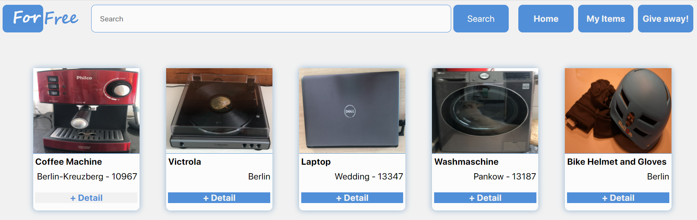

# ForFree

ForFree is a project inspired by the Facebook group Free Your Staff Berlin and my personal desire to improve my interaction with the consumption of goods.

I firmly believe that everyone can take the first step towards a more prepared society to consume consciously and responsibly. 

Do we really need to always buy new things?

I don't think so and I think we can make a difference together and move towards a society that uses natural resources better, consumes better and is more aware of the impact of consumption on the climate and the environment.

This project is just getting started. I present here the outline of an idea and a desire to become a better and more useful person for society.
## Screenshot

<p align="center">
  
</p>

## Getting Started

1. Clone this repository with the command and get into the main directory
   ```bash
   git clone https://github.com/anakreppel/ForFree
   cd heaps
   ```
2. Get into the server directory and install the dependencies
   ```bash
   cd server
   npm install
   ```
3. From the server directory, get into the client directory and install the dependencies there as well

   ```bash
   cd ../client
   npm install
   ```

4. The app uses a MongoDB database. In the server/db.js file, on line 3, replace the _process.env.DB_URL_ with a link to your own MongoDB database.

